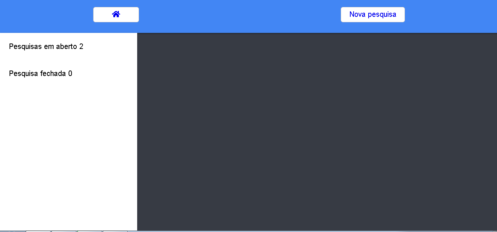
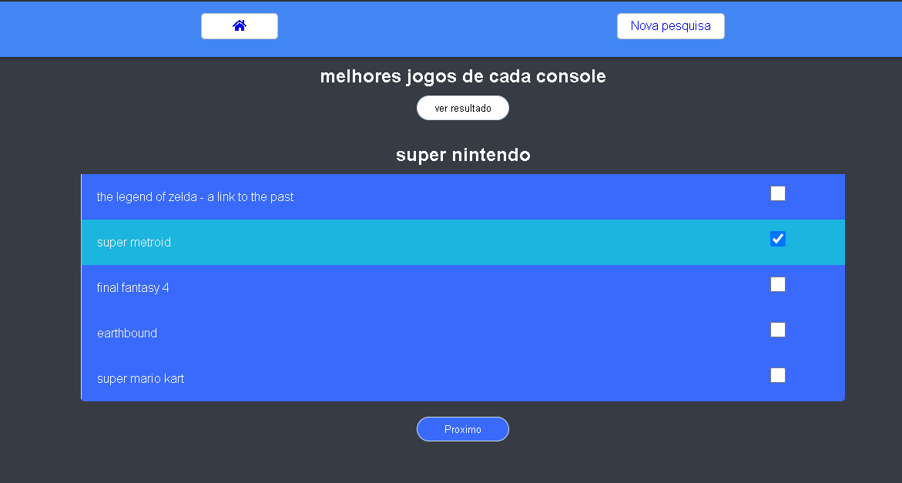
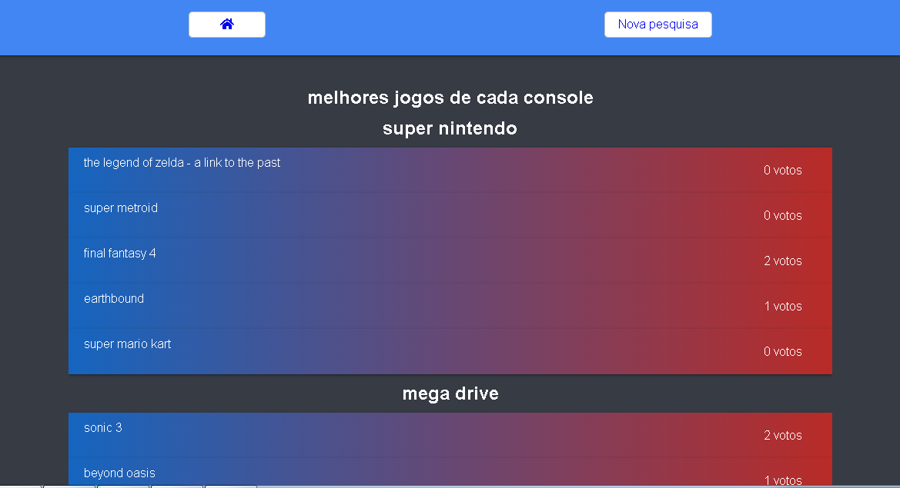

# app-react-typescript-survey

Projeto feito com node, react e typescript, o objetivo era estudar mais o typescript, o site não esta responsivel 

<b>Features</b>
<ul>
    <ul>
        <li>Enviar o questionario com ate 10 perguntas e ate 10 dias para expirar</li>
        <li>Criar questionario</li>
        <li>Votar no questionario</li>
        <li>Exibi se expirou ou não</li>
        <li>Mostrar resultados</li>
     </ul>
</ul>

